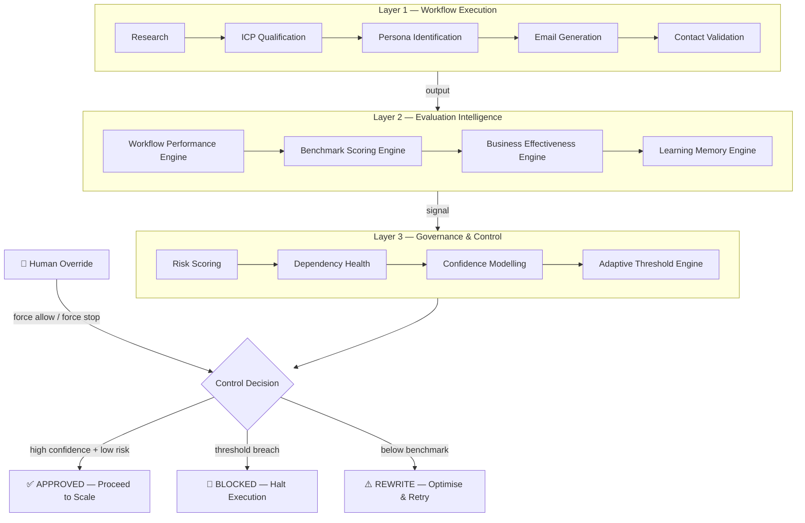

# GOVR — Governed Revenue Execution

> An AI SDR agent with a production-grade evaluation and governance layer.  
> Built to ensure AI-generated outreach aligns with revenue outcomes — not just task completion.

**Live Demo → [web-production-9ea0.up.railway.app](https://web-production-9ea0.up.railway.app)**

---

## The Problem

Most AI SDR tools optimise for generation speed.

They answer: *"Did the workflow run?"*

They don't answer: *"Is it necessary to have?"*

This creates four systemic gaps in enterprise AI outreach:

| Gap | What breaks |
|-----|-------------|
| No evaluation framework | Inconsistent output quality, brand risk |
| No revenue alignment model | High activity, low conversion |
| Static governance rules | No adaptation to performance history |
| No market awareness | Teams operating blind relative to industry baseline |

Scale amplifies both strength and weakness. Without evaluation and governance, AI becomes a multiplier of risk.

---

## The Gap

Existing tools each solve one piece of the problem — none of them connect the pieces.

| Tool Category | What it does | What it misses |
|---------------|-------------|----------------|
| Data enrichment (Apollo, Clay) | Finds who to reach | No signal on whether to reach them |
| Sequencing (Outreach, Instantly) | Automates send cadences | No quality control before sending |
| AI SDRs (11x, Artisan) | Replaces the SDR motion | No governance over what gets sent |
| Revenue intelligence (Gong, Clari) | Analyses what happened | Reactive — damage already done |

The result: teams know *how* to automate outreach. Nobody has built the layer that decides *whether it should run*.

That is the gap GOVR fills.

---

## The Solution

GOVR introduces a **three-layer architecture** that sits between AI generation and outbound execution.



Only workflows that pass all three layers are allowed to scale.

---

## Architecture

### Layer 1 — Workflow Execution

Handles company research, ICP qualification, persona identification, email generation, and contact validation via a LangGraph state machine.

This layer produces output. It does not decide whether that output should be executed.

### Layer 2 — Evaluation Intelligence

Four engines run in sequence:

**Workflow Performance Engine**  
Scores the workflow across six revenue-weighted dimensions: research depth, qualification strength, persona validity, email effectiveness, contact authority, governance stability. Outputs a unified performance score and strategic recommendation.

**Benchmark Scoring Engine**  
Compares performance against industry baselines. Outputs competitive position: Elite / Strong / Parity / Below Standard. Reframes evaluation from *"Is it good?"* to *"Is it competitive?"*

**Business Effectiveness Engine**  
Models expected revenue impact using qualification score, workflow performance, and contact authority. Outputs conversion probability and revenue readiness signal.

**Learning Memory Engine**  
Stores historical workflow scores and governance decisions. Generates system confidence score and control bias — making governance adaptive, not static.

### Layer 3 — Governance & Control

Five signals converge into one decision:

| Signal | What it detects |
|--------|----------------|
| Risk Score | Guardrail failures, retry instability, missing outputs |
| Dependency Health | Structural integrity of the workflow chain |
| Confidence Score | Derived from performance stability and evaluation consistency |
| Adaptive Threshold | Tightens or loosens based on historical performance |
| Control Decision | Final authority — APPROVED, BLOCKED, or REWRITE |

**Human Override** is available at any point. All overrides are logged with timestamp, actor, and governance state at time of intervention.

---

## Tech Stack

| Layer | Technology |
|-------|-----------|
| Agent orchestration | LangGraph |
| AI providers | Google Gemini, Anthropic Claude, Groq |
| Web search | Tavily |
| Contact finding | Apollo.io |
| Email sending | Gmail API |
| Tracking | Google Sheets |
| Backend | FastAPI |
| Frontend | Vanilla HTML/CSS/JS |
| Deployment | Railway |

---

## Project Structure

```
govr/
├── agent/
│   ├── core/              # LangGraph graph, nodes, state, LLM factory
│   ├── evaluation/        # Benchmark, business effectiveness, workflow performance engines
│   ├── governance/        # Adaptive threshold, confidence, control, risk engines
│   ├── guardrails/        # Per-node guardrails + universal aggregator
│   ├── infra/             # Config, Google Sheets logger
│   ├── retry/             # Retry engine and strategies
│   └── tools/             # Email finder, sender, LinkedIn, research
├── frontend/              # Single-page marketing + live demo UI
├── api.py                 # FastAPI server
├── main.py                # CLI entry point
└── requirements.txt
```

---

## Running Locally

**1. Clone and install**
```bash
git clone https://github.com/YOURNAME/govr.git
cd govr
pip install -r requirements.txt
```

**2. Configure environment**
```bash
cp .env.example .env
# Add your API keys
```

**3. Start the server**
```bash
uvicorn api:app --reload
```

**4. Open the UI**  
Navigate to `http://localhost:8000` — enter a company name in the Try It tab.

**Or run via CLI**
```bash
python main.py "Stripe"
```

---

## Environment Variables

```env
AI_PROVIDER=google          # google | anthropic | groq
GOOGLE_API_KEY=
ANTHROPIC_API_KEY=
GROQ_API_KEY=
TAVILY_API_KEY=
APOLLO_API_KEY=
GMAIL_ADDRESS=
GMAIL_APP_PASSWORD=
ENABLE_EMAIL_SENDING=False
ENABLE_LINKEDIN_OUTREACH=False
ENABLE_SHEETS_LOGGING=False
```

---

## What This Demonstrates

This project is not a demo wrapper around an LLM.

It is a production-oriented system that reflects how AI should be deployed in revenue-critical workflows:

- **Problem-first architecture** — every layer exists because of a specific enterprise gap
- **Evaluation before execution** — nothing runs without being scored first
- **Revenue-weighted scoring** — dimensions weighted by business impact, not surface quality
- **Adaptive governance** — strictness evolves with performance history
- **Human-in-the-loop by design** — override capability built in, not bolted on
- **Responsible AI thinking** — governance is the foundation, not a feature

It reframes AI from automation tool to governed revenue operator.

---

## Live Demo

**[https://web-production-9ea0.up.railway.app](https://web-production-9ea0.up.railway.app)**

Enter any company name. The full governance workflow runs and returns a live verdict.

---

*-Dhanishta*
